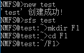
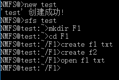

！！！The project has stopped development and maintenance.
===  
# NewMiniFS  
操作系统的文件系统作业  

## 一、获取
GitHub上有最新的发布版本：https://github.com/InspAlgo/NewMiniFS/releases  
适用于 win10 x64 系统  
  
## 二、使用方法    
1. 创建一个新的文件系统  
创建名为 *test* 的文件系统 `new test`   
   
2. 打开一个文件系统   
打开名为 *test* 的文件系统 `sfs test`   
   
3. 创建一个子目录   
创建名为 *F1* 的子目录 `mkdir F1`   
   
**注意：** 文件夹的名称不能超过 8 字节且不能带有 `\` 和 `/` 字符，同时创建的位置只能是在当前位置，所以名称中不能带有路径信息，且每次只能创建一个文件夹。    
4. 更改当前目录    
转移到子目录 *F1* 中 `cd F1`    
    
**注意：** 路径中可以使用 `\` 或 `/`，使用 `.` 表示当前文件夹，使用 `..` 表示上一级文件夹。    
5. 创建文件    
创建名为 *f1* 类型/后缀为 *txt* 的文件 `create f1 txt`    
创建名为 *f2* 无类型/后缀的文件 `create f2`    
    
**注意：** 文件的名称不能超过 8 字节且不能带有 `\` 和 `/` 字符，同时创建的位置只能是在当前位置，所以名称中不能带有路径信息，且每次只能创建一个文件，文件的类型/后缀需要分开输入，且长度不能超过 4 字节同时不能带有 `\` 和 `/` 字符。    
6. 打开文件   
打开名为 *f1* 类型/后缀为 *txt* 的文件 `open f1 txt`    
打开名为 *f2* 无类型/后缀的文件 `open f2`   
   
   
7. 关闭文件    
如果当前有打开文件，则直接关闭 `close`   
    
8. 读文件    
读文件需要先打开一个文件，然后直接读取 `read`    
   
   
**注意：** 新创建的文件均为空文件，读取时会显示空一行。    
9. 写文件   
写文件需要先打开一个文件，然后直接写 `write`   
    
**注意：** 写文件的结束标记为 **EOF**，所以在 win10 上需要输入 **Ctrl+Z**，再两次回车。    
10. 显示目录    
直接输入 `ls` 或 `ls -t` 显示当前目录信息，输入 `ls -rt` 则显示根目录信息。   
    
    
   
**注意：** 所有的文件夹后面均会有一个 \* 来标记。    
11. 删除文件   
删除名为 *f1* 类型/后缀为 *txt* 的文件 `delete f1 txt`    
删除名为 *f2* 无类型/后缀的文件 `delete f2`   
   
    
**注意：** 每次删除只能删除当前文件夹下的文件，且只能一次删除一个文件。    
12. 删除子目录    
删除名为 *F1* 的子目录 `rmdir F1`    
    
**注意：** 每次删除只能删除当前文件夹下的文件夹，且只能一次删除一个文件夹。     
13. 退出打开的文件系统    
直接退出 `exit`    
    
